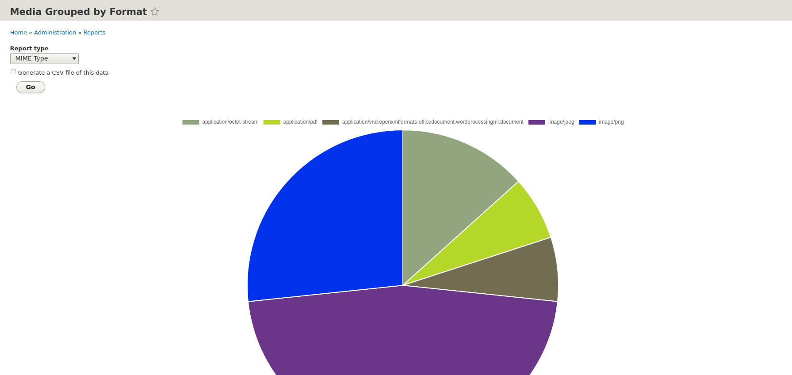

# Media Formats Reports

## Introduction

A Drupal 8 module to provide a visual report (chart) showing the frequency of formats using either MIME type or, if Islandora FITS is installed, [PRONOM PUID](https://en.wikipedia.org/wiki/PRONOM).

## Overview

Users with "Administer Site Configuration" can visit the reports page from Drupal's Reports list. The link to "Media Formats" will show the default MIME type report:

If Islandora FITS is installed, users can choose "PUID" from the "Report type" list.

## Requirements

* [Islandora 8](https://github.com/Islandora/islandora)
* [Islandora FITS](https://github.com/Islandora/islandora)

## Installation

1. Clone this repo into your Islandora's `drupal/web/modules/contrib` directory.
1. Enable the module either under the "Admin > Extend" menu or by running `drush en -y media_formats_reports`.

## Current maintainer

* [Mark Jordan](https://github.com/mjordan)

## License

[GPLv2](http://www.gnu.org/licenses/gpl-2.0.txt)
